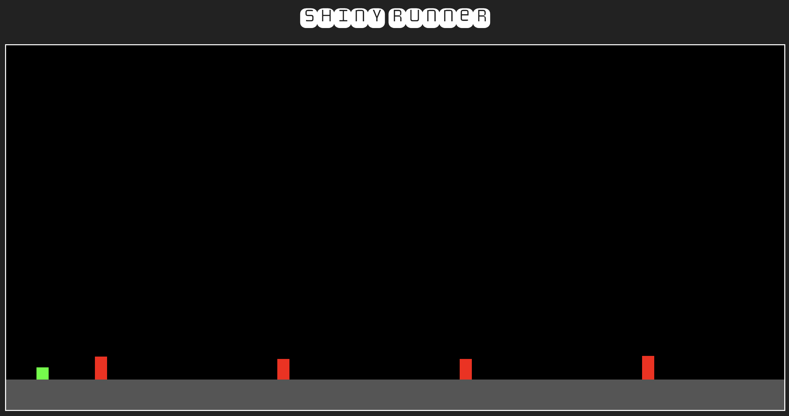

The most minimalist 2D side scroller, ever. EVER.

The entirety of the `app.R` was built with OpenAI's `o3-mini-high` instruct endpoint. I'll continue to revisit my chat conversation to iterate. I've spent very little time optimizing this manually, by design. But... Not bad, mon ami `o3-mini`... Not bad at all.